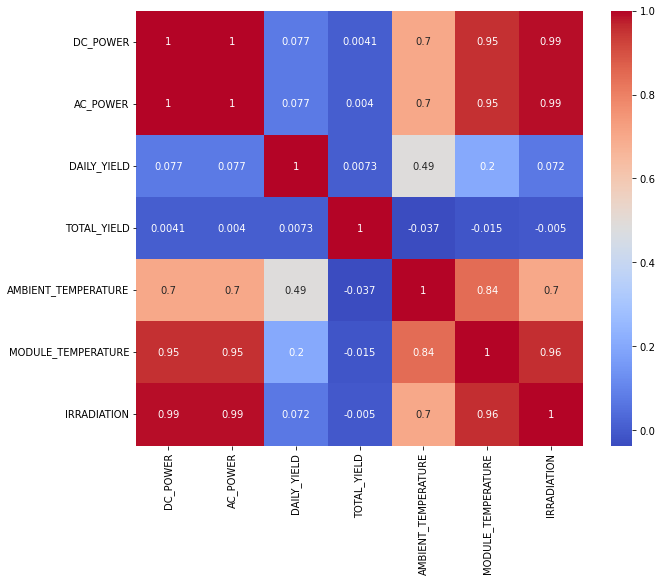
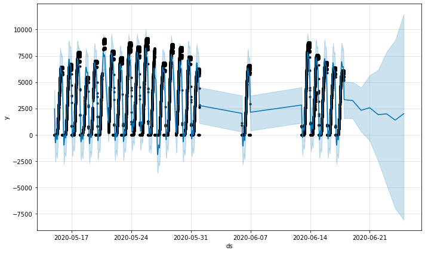
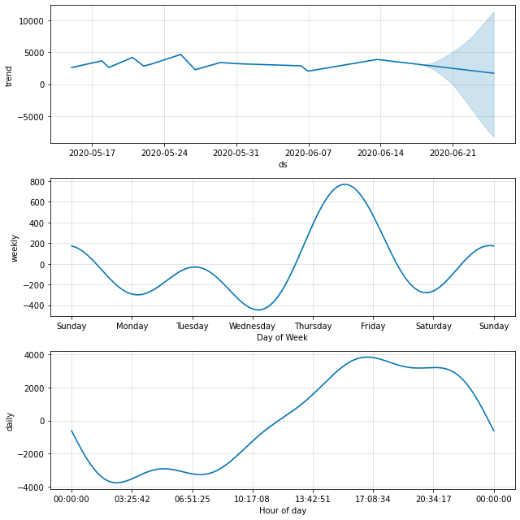
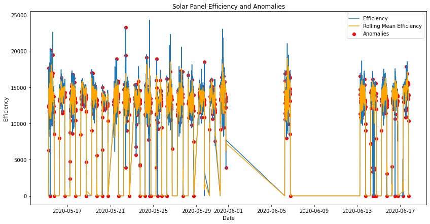
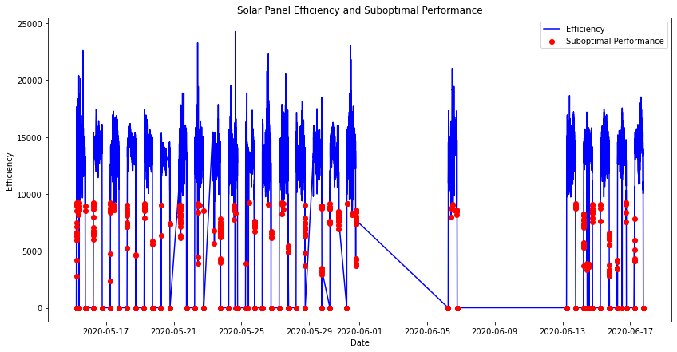

```python
import pandas as pd
import numpy as np
import seaborn as sns 
import matplotlib.pyplot as plt
%matplotlib inline 
import warnings
warnings.filterwarnings("ignore")
```


```python
# Importing Power Generation & Weather Sensor Data
generation_dt = pd.read_csv('../Downloads/Plant_1_Generation_Data.csv')
weather_dt = pd.read_csv('../Downloads/Plant_1_Weather_Sensor_Data.csv')
```


```python
# Preview of generation_dt
generation_dt.sample(5)
```


<div>
<style scoped>
    .dataframe tbody tr th:only-of-type {
        vertical-align: middle;
    }

    .dataframe tbody tr th {
        vertical-align: top;
    }

    .dataframe thead th {
        text-align: right;
    }
</style>
<table border="1" class="dataframe">
  <thead>
    <tr style="text-align: right;">
      <th></th>
      <th>DATE_TIME</th>
      <th>PLANT_ID</th>
      <th>SOURCE_KEY</th>
      <th>DC_POWER</th>
      <th>AC_POWER</th>
      <th>DAILY_YIELD</th>
      <th>TOTAL_YIELD</th>
    </tr>
  </thead>
  <tbody>
    <tr>
      <th>51104</th>
      <td>09-06-2020 14:30</td>
      <td>4135001</td>
      <td>pkci93gMrogZuBj</td>
      <td>9720.25000</td>
      <td>949.512500</td>
      <td>6283.500000</td>
      <td>7360759.500</td>
    </tr>
    <tr>
      <th>62</th>
      <td>15-05-2020 00:30</td>
      <td>4135001</td>
      <td>zVJPv84UY57bAof</td>
      <td>0.00000</td>
      <td>0.000000</td>
      <td>0.000000</td>
      <td>7116151.000</td>
    </tr>
    <tr>
      <th>11097</th>
      <td>20-05-2020 11:15</td>
      <td>4135001</td>
      <td>VHMLBKoKgIrUVDU</td>
      <td>12383.14286</td>
      <td>1207.385714</td>
      <td>3390.857143</td>
      <td>7242932.857</td>
    </tr>
    <tr>
      <th>11914</th>
      <td>21-05-2020 09:15</td>
      <td>4135001</td>
      <td>ZnxXDlPa8U1GXgE</td>
      <td>8502.75000</td>
      <td>831.925000</td>
      <td>1209.125000</td>
      <td>6565254.125</td>
    </tr>
    <tr>
      <th>59050</th>
      <td>13-06-2020 08:45</td>
      <td>4135001</td>
      <td>wCURE6d3bPkepu2</td>
      <td>7399.37500</td>
      <td>724.462500</td>
      <td>851.125000</td>
      <td>6994759.125</td>
    </tr>
  </tbody>
</table>
</div>


```python
# Preview of weather_dt
weather_dt.sample(5)
```


<div>
<style scoped>
    .dataframe tbody tr th:only-of-type {
        vertical-align: middle;
    }

    .dataframe tbody tr th {
        vertical-align: top;
    }

    .dataframe thead th {
        text-align: right;
    }
</style>
<table border="1" class="dataframe">
  <thead>
    <tr style="text-align: right;">
      <th></th>
      <th>DATE_TIME</th>
      <th>PLANT_ID</th>
      <th>SOURCE_KEY</th>
      <th>AMBIENT_TEMPERATURE</th>
      <th>MODULE_TEMPERATURE</th>
      <th>IRRADIATION</th>
    </tr>
  </thead>
  <tbody>
    <tr>
      <th>479</th>
      <td>2020-05-20 03:15:00</td>
      <td>4135001</td>
      <td>HmiyD2TTLFNqkNe</td>
      <td>22.009417</td>
      <td>19.457879</td>
      <td>0.000000</td>
    </tr>
    <tr>
      <th>529</th>
      <td>2020-05-20 19:45:00</td>
      <td>4135001</td>
      <td>HmiyD2TTLFNqkNe</td>
      <td>25.841024</td>
      <td>23.006691</td>
      <td>0.000000</td>
    </tr>
    <tr>
      <th>1904</th>
      <td>2020-06-04 16:30:00</td>
      <td>4135001</td>
      <td>HmiyD2TTLFNqkNe</td>
      <td>28.226300</td>
      <td>39.781594</td>
      <td>0.423150</td>
    </tr>
    <tr>
      <th>2937</th>
      <td>2020-06-15 10:45:00</td>
      <td>4135001</td>
      <td>HmiyD2TTLFNqkNe</td>
      <td>27.778299</td>
      <td>46.052281</td>
      <td>0.860845</td>
    </tr>
    <tr>
      <th>2139</th>
      <td>2020-06-07 03:15:00</td>
      <td>4135001</td>
      <td>HmiyD2TTLFNqkNe</td>
      <td>21.953225</td>
      <td>20.305245</td>
      <td>0.000000</td>
    </tr>
  </tbody>
</table>
</div>


```python
generation_dt['DATE_TIME'] = pd.to_datetime(generation_dt['DATE_TIME'])
weather_dt['DATE_TIME'] = pd.to_datetime(weather_dt['DATE_TIME'])
```


```python
# Merging on the DATE_TIME column
df_solar = pd.merge(generation_dt, weather_dt, on='DATE_TIME', suffixes=('_gen', '_weather'))

# Dropping unnecessary columns
df_solar = df_solar.drop(columns=['PLANT_ID_gen','PLANT_ID_weather', 'SOURCE_KEY_weather'])

#Preview of df_solar
df_solar.sample(5)
```


<div>
<style scoped>
    .dataframe tbody tr th:only-of-type {
        vertical-align: middle;
    }

    .dataframe tbody tr th {
        vertical-align: top;
    }

    .dataframe thead th {
        text-align: right;
    }
</style>
<table border="1" class="dataframe">
  <thead>
    <tr style="text-align: right;">
      <th></th>
      <th>DATE_TIME</th>
      <th>SOURCE_KEY_gen</th>
      <th>DC_POWER</th>
      <th>AC_POWER</th>
      <th>DAILY_YIELD</th>
      <th>TOTAL_YIELD</th>
      <th>AMBIENT_TEMPERATURE</th>
      <th>MODULE_TEMPERATURE</th>
      <th>IRRADIATION</th>
    </tr>
  </thead>
  <tbody>
    <tr>
      <th>4710</th>
      <td>2020-05-17 09:15:00</td>
      <td>ZnxXDlPa8U1GXgE</td>
      <td>6706.125000</td>
      <td>656.625000</td>
      <td>1136.625000</td>
      <td>6536288.625</td>
      <td>27.985940</td>
      <td>45.117410</td>
      <td>0.441706</td>
    </tr>
    <tr>
      <th>26364</th>
      <td>2020-05-28 10:30:00</td>
      <td>sjndEbLyjtCKgGv</td>
      <td>9185.857143</td>
      <td>897.471429</td>
      <td>2457.714286</td>
      <td>7115022.714</td>
      <td>29.480094</td>
      <td>54.250505</td>
      <td>0.818236</td>
    </tr>
    <tr>
      <th>14865</th>
      <td>2020-05-22 20:30:00</td>
      <td>7JYdWkrLSPkdwr4</td>
      <td>0.000000</td>
      <td>0.000000</td>
      <td>7135.000000</td>
      <td>7658770.000</td>
      <td>26.645117</td>
      <td>24.928733</td>
      <td>0.000000</td>
    </tr>
    <tr>
      <th>41770</th>
      <td>2020-06-16 03:00:00</td>
      <td>WRmjgnKYAwPKWDb</td>
      <td>0.000000</td>
      <td>0.000000</td>
      <td>0.000000</td>
      <td>7261315.000</td>
      <td>22.499713</td>
      <td>21.391532</td>
      <td>0.000000</td>
    </tr>
    <tr>
      <th>8915</th>
      <td>2020-05-19 09:00:00</td>
      <td>bvBOhCH3iADSZry</td>
      <td>5002.375000</td>
      <td>490.687500</td>
      <td>613.000000</td>
      <td>6341151.000</td>
      <td>26.121533</td>
      <td>36.858085</td>
      <td>0.386892</td>
    </tr>
  </tbody>
</table>
</div>


```python
### Correlation matrix ### 
plt.figure(figsize=(10, 8))
sns.heatmap(df_solar.corr(), annot=True, cmap='coolwarm')
plt.show()
```


    

    


```python
import plotly.express as px
import plotly.graph_objs as go

dfpie = df_solar.groupby('SOURCE_KEY_gen')['DAILY_YIELD'].count()
fig = px.pie(values=dfpie.values, names=dfpie.index, 
            title = 'Proportional Analysis of DAILY_YIELD with SOURCE_KEY')
fig.show()
```


<div>                            <div id="6c9e1f7f-dd48-4343-b5fa-2b6c3fae2a58" class="plotly-graph-div" style="height:525px; width:100%;"></div>            <script type="text/javascript">                require(["plotly"], function(Plotly) {                    window.PLOTLYENV=window.PLOTLYENV || {};                                    if (document.getElementById("6c9e1f7f-dd48-4343-b5fa-2b6c3fae2a58")) {                    Plotly.newPlot(                        "6c9e1f7f-dd48-4343-b5fa-2b6c3fae2a58",                        [{"domain":{"x":[0.0,1.0],"y":[0.0,1.0]},"hovertemplate":"label=%{label}<br>value=%{value}<extra></extra>","labels":["1BY6WEcLGh8j5v7","1IF53ai7Xc0U56Y","3PZuoBAID5Wc2HD","7JYdWkrLSPkdwr4","McdE0feGgRqW7Ca","VHMLBKoKgIrUVDU","WRmjgnKYAwPKWDb","YxYtjZvoooNbGkE","ZnxXDlPa8U1GXgE","ZoEaEvLYb1n2sOq","adLQvlD726eNBSB","bvBOhCH3iADSZry","iCRJl6heRkivqQ3","ih0vzX44oOqAx2f","pkci93gMrogZuBj","rGa61gmuvPhdLxV","sjndEbLyjtCKgGv","uHbuxQJl8lW7ozc","wCURE6d3bPkepu2","z9Y9gH1T5YWrNuG","zBIq5rxdHJRwDNY","zVJPv84UY57bAof"],"legendgroup":"","name":"","showlegend":true,"values":[2099,2070,2070,2085,2074,2085,2070,2054,2082,2073,2070,2100,2075,2082,2075,2074,2074,2075,2075,2075,2069,2074],"type":"pie"}],                        {"template":{"data":{"bar":[{"error_x":{"color":"#2a3f5f"},"error_y":{"color":"#2a3f5f"},"marker":{"line":{"color":"#E5ECF6","width":0.5},"pattern":{"fillmode":"overlay","size":10,"solidity":0.2}},"type":"bar"}],"barpolar":[{"marker":{"line":{"color":"#E5ECF6","width":0.5},"pattern":{"fillmode":"overlay","size":10,"solidity":0.2}},"type":"barpolar"}],"carpet":[{"aaxis":{"endlinecolor":"#2a3f5f","gridcolor":"white","linecolor":"white","minorgridcolor":"white","startlinecolor":"#2a3f5f"},"baxis":{"endlinecolor":"#2a3f5f","gridcolor":"white","linecolor":"white","minorgridcolor":"white","startlinecolor":"#2a3f5f"},"type":"carpet"}],"choropleth":[{"colorbar":{"outlinewidth":0,"ticks":""},"type":"choropleth"}],"contour":[{"colorbar":{"outlinewidth":0,"ticks":""},"colorscale":[[0.0,"#0d0887"],[0.1111111111111111,"#46039f"],[0.2222222222222222,"#7201a8"],[0.3333333333333333,"#9c179e"],[0.4444444444444444,"#bd3786"],[0.5555555555555556,"#d8576b"],[0.6666666666666666,"#ed7953"],[0.7777777777777778,"#fb9f3a"],[0.8888888888888888,"#fdca26"],[1.0,"#f0f921"]],"type":"contour"}],"contourcarpet":[{"colorbar":{"outlinewidth":0,"ticks":""},"type":"contourcarpet"}],"heatmap":[{"colorbar":{"outlinewidth":0,"ticks":""},"colorscale":[[0.0,"#0d0887"],[0.1111111111111111,"#46039f"],[0.2222222222222222,"#7201a8"],[0.3333333333333333,"#9c179e"],[0.4444444444444444,"#bd3786"],[0.5555555555555556,"#d8576b"],[0.6666666666666666,"#ed7953"],[0.7777777777777778,"#fb9f3a"],[0.8888888888888888,"#fdca26"],[1.0,"#f0f921"]],"type":"heatmap"}],"heatmapgl":[{"colorbar":{"outlinewidth":0,"ticks":""},"colorscale":[[0.0,"#0d0887"],[0.1111111111111111,"#46039f"],[0.2222222222222222,"#7201a8"],[0.3333333333333333,"#9c179e"],[0.4444444444444444,"#bd3786"],[0.5555555555555556,"#d8576b"],[0.6666666666666666,"#ed7953"],[0.7777777777777778,"#fb9f3a"],[0.8888888888888888,"#fdca26"],[1.0,"#f0f921"]],"type":"heatmapgl"}],"histogram":[{"marker":{"pattern":{"fillmode":"overlay","size":10,"solidity":0.2}},"type":"histogram"}],"histogram2d":[{"colorbar":{"outlinewidth":0,"ticks":""},"colorscale":[[0.0,"#0d0887"],[0.1111111111111111,"#46039f"],[0.2222222222222222,"#7201a8"],[0.3333333333333333,"#9c179e"],[0.4444444444444444,"#bd3786"],[0.5555555555555556,"#d8576b"],[0.6666666666666666,"#ed7953"],[0.7777777777777778,"#fb9f3a"],[0.8888888888888888,"#fdca26"],[1.0,"#f0f921"]],"type":"histogram2d"}],"histogram2dcontour":[{"colorbar":{"outlinewidth":0,"ticks":""},"colorscale":[[0.0,"#0d0887"],[0.1111111111111111,"#46039f"],[0.2222222222222222,"#7201a8"],[0.3333333333333333,"#9c179e"],[0.4444444444444444,"#bd3786"],[0.5555555555555556,"#d8576b"],[0.6666666666666666,"#ed7953"],[0.7777777777777778,"#fb9f3a"],[0.8888888888888888,"#fdca26"],[1.0,"#f0f921"]],"type":"histogram2dcontour"}],"mesh3d":[{"colorbar":{"outlinewidth":0,"ticks":""},"type":"mesh3d"}],"parcoords":[{"line":{"colorbar":{"outlinewidth":0,"ticks":""}},"type":"parcoords"}],"pie":[{"automargin":true,"type":"pie"}],"scatter":[{"marker":{"colorbar":{"outlinewidth":0,"ticks":""}},"type":"scatter"}],"scatter3d":[{"line":{"colorbar":{"outlinewidth":0,"ticks":""}},"marker":{"colorbar":{"outlinewidth":0,"ticks":""}},"type":"scatter3d"}],"scattercarpet":[{"marker":{"colorbar":{"outlinewidth":0,"ticks":""}},"type":"scattercarpet"}],"scattergeo":[{"marker":{"colorbar":{"outlinewidth":0,"ticks":""}},"type":"scattergeo"}],"scattergl":[{"marker":{"colorbar":{"outlinewidth":0,"ticks":""}},"type":"scattergl"}],"scattermapbox":[{"marker":{"colorbar":{"outlinewidth":0,"ticks":""}},"type":"scattermapbox"}],"scatterpolar":[{"marker":{"colorbar":{"outlinewidth":0,"ticks":""}},"type":"scatterpolar"}],"scatterpolargl":[{"marker":{"colorbar":{"outlinewidth":0,"ticks":""}},"type":"scatterpolargl"}],"scatterternary":[{"marker":{"colorbar":{"outlinewidth":0,"ticks":""}},"type":"scatterternary"}],"surface":[{"colorbar":{"outlinewidth":0,"ticks":""},"colorscale":[[0.0,"#0d0887"],[0.1111111111111111,"#46039f"],[0.2222222222222222,"#7201a8"],[0.3333333333333333,"#9c179e"],[0.4444444444444444,"#bd3786"],[0.5555555555555556,"#d8576b"],[0.6666666666666666,"#ed7953"],[0.7777777777777778,"#fb9f3a"],[0.8888888888888888,"#fdca26"],[1.0,"#f0f921"]],"type":"surface"}],"table":[{"cells":{"fill":{"color":"#EBF0F8"},"line":{"color":"white"}},"header":{"fill":{"color":"#C8D4E3"},"line":{"color":"white"}},"type":"table"}]},"layout":{"annotationdefaults":{"arrowcolor":"#2a3f5f","arrowhead":0,"arrowwidth":1},"autotypenumbers":"strict","coloraxis":{"colorbar":{"outlinewidth":0,"ticks":""}},"colorscale":{"diverging":[[0,"#8e0152"],[0.1,"#c51b7d"],[0.2,"#de77ae"],[0.3,"#f1b6da"],[0.4,"#fde0ef"],[0.5,"#f7f7f7"],[0.6,"#e6f5d0"],[0.7,"#b8e186"],[0.8,"#7fbc41"],[0.9,"#4d9221"],[1,"#276419"]],"sequential":[[0.0,"#0d0887"],[0.1111111111111111,"#46039f"],[0.2222222222222222,"#7201a8"],[0.3333333333333333,"#9c179e"],[0.4444444444444444,"#bd3786"],[0.5555555555555556,"#d8576b"],[0.6666666666666666,"#ed7953"],[0.7777777777777778,"#fb9f3a"],[0.8888888888888888,"#fdca26"],[1.0,"#f0f921"]],"sequentialminus":[[0.0,"#0d0887"],[0.1111111111111111,"#46039f"],[0.2222222222222222,"#7201a8"],[0.3333333333333333,"#9c179e"],[0.4444444444444444,"#bd3786"],[0.5555555555555556,"#d8576b"],[0.6666666666666666,"#ed7953"],[0.7777777777777778,"#fb9f3a"],[0.8888888888888888,"#fdca26"],[1.0,"#f0f921"]]},"colorway":["#636efa","#EF553B","#00cc96","#ab63fa","#FFA15A","#19d3f3","#FF6692","#B6E880","#FF97FF","#FECB52"],"font":{"color":"#2a3f5f"},"geo":{"bgcolor":"white","lakecolor":"white","landcolor":"#E5ECF6","showlakes":true,"showland":true,"subunitcolor":"white"},"hoverlabel":{"align":"left"},"hovermode":"closest","mapbox":{"style":"light"},"paper_bgcolor":"white","plot_bgcolor":"#E5ECF6","polar":{"angularaxis":{"gridcolor":"white","linecolor":"white","ticks":""},"bgcolor":"#E5ECF6","radialaxis":{"gridcolor":"white","linecolor":"white","ticks":""}},"scene":{"xaxis":{"backgroundcolor":"#E5ECF6","gridcolor":"white","gridwidth":2,"linecolor":"white","showbackground":true,"ticks":"","zerolinecolor":"white"},"yaxis":{"backgroundcolor":"#E5ECF6","gridcolor":"white","gridwidth":2,"linecolor":"white","showbackground":true,"ticks":"","zerolinecolor":"white"},"zaxis":{"backgroundcolor":"#E5ECF6","gridcolor":"white","gridwidth":2,"linecolor":"white","showbackground":true,"ticks":"","zerolinecolor":"white"}},"shapedefaults":{"line":{"color":"#2a3f5f"}},"ternary":{"aaxis":{"gridcolor":"white","linecolor":"white","ticks":""},"baxis":{"gridcolor":"white","linecolor":"white","ticks":""},"bgcolor":"#E5ECF6","caxis":{"gridcolor":"white","linecolor":"white","ticks":""}},"title":{"x":0.05},"xaxis":{"automargin":true,"gridcolor":"white","linecolor":"white","ticks":"","title":{"standoff":15},"zerolinecolor":"white","zerolinewidth":2},"yaxis":{"automargin":true,"gridcolor":"white","linecolor":"white","ticks":"","title":{"standoff":15},"zerolinecolor":"white","zerolinewidth":2}}},"legend":{"tracegroupgap":0},"title":{"text":"Proportional Analysis of DAILY_YIELD with SOURCE_KEY"}},                        {"responsive": true}                    ).then(function(){

var gd = document.getElementById('6c9e1f7f-dd48-4343-b5fa-2b6c3fae2a58');
var x = new MutationObserver(function (mutations, observer) {{
        var display = window.getComputedStyle(gd).display;
        if (!display || display === 'none') {{
            console.log([gd, 'removed!']);
            Plotly.purge(gd);
            observer.disconnect();
        }}
}});

// Listen for the removal of the full notebook cells
var notebookContainer = gd.closest('#notebook-container');
if (notebookContainer) {{
    x.observe(notebookContainer, {childList: true});
}}

// Listen for the clearing of the current output cell
var outputEl = gd.closest('.output');
if (outputEl) {{
    x.observe(outputEl, {childList: true});
}}

                        })                };                });            </script>        </div>


```python

### Predict the power generation for the next few days ###

```


```python
# Convert DATE_TIME to datetime and set as index
df_solar.set_index('DATE_TIME', inplace=True)
df_solar = df_solar.sort_index()
```


```python
# Creating lag features and rolling means
df_solar['lag_1'] = df_solar['DAILY_YIELD'].shift(1)
df_solar['lag_7'] = df_solar['DAILY_YIELD'].shift(7)
df_solar['rolling_mean_7'] = df_solar['DAILY_YIELD'].rolling(window=7).mean()

# Drop rows with NaN values created by the shifts
df_solar.dropna(inplace=True)
```


```python
from prophet import Prophet

# Prepare the data for Prophet
df_prophet = df_solar.reset_index()[['DATE_TIME', 'DAILY_YIELD']]
df_prophet.rename(columns={'DATE_TIME': 'ds', 'DAILY_YIELD': 'y'}, inplace=True)

# Initialize and train the Prophet model
model = Prophet()
model.fit(df_prophet)

# Create a dataframe to hold future dates
future = model.make_future_dataframe(periods=7)  # Predicting the next 7 days

# Forecast
forecast = model.predict(future)

# Plot the forecast
fig = model.plot(forecast)
fig.show()

```

    16:54:55 - cmdstanpy - INFO - Chain [1] start processing
    16:55:08 - cmdstanpy - INFO - Chain [1] done processing


    

    


```python
# Display the forecasted values
print(forecast[['ds', 'yhat', 'yhat_lower', 'yhat_upper']].tail())

# Plot components
fig2 = model.plot_components(forecast)
fig2.show()
```

                          ds         yhat   yhat_lower    yhat_upper
    2104 2020-06-20 23:45:00  2563.560731  -555.639084   5651.772083
    2105 2020-06-21 23:45:00  1909.412510 -2520.516370   6149.026357
    2106 2020-06-22 23:45:00  1976.585983 -4779.278290   7902.973941
    2107 2020-06-23 23:45:00  1386.272118 -7022.646449   8971.956045
    2108 2020-06-24 23:45:00  1995.959567 -8104.598880  11465.913541


    

    


```python

### Identify the need for panel cleaning ###

```


```python
# Calculate efficiency
df_solar['efficiency'] = df_solar['DC_POWER'] / df_solar['IRRADIATION']

# Calculate rolling mean and standard deviation for efficiency
df_solar['efficiency_mean'] = df_solar['efficiency'].rolling(window=7).mean()
df_solar['efficiency_std'] = df_solar['efficiency'].rolling(window=7).std()

# Drop rows with NaN values created by the rolling operations
df_solar = df_solar.dropna(subset=['efficiency', 'efficiency_mean', 'efficiency_std'])

# Display the first few rows
print(df_solar[['efficiency', 'efficiency_mean', 'efficiency_std']].sample(5))
```

                           efficiency  efficiency_mean  efficiency_std
    DATE_TIME                                                         
    2020-05-18 10:00:00  15491.332136     15395.566903      434.016056
    2020-06-16 11:30:00  13150.131758     13611.546059      315.312831
    2020-05-27 13:15:00  14631.621465     13855.498739     1011.266167
    2020-06-13 16:30:00  16729.595025     14991.140794     1287.910108
    2020-06-16 13:15:00  13883.979922     14194.994330     1522.873462


```python
# Calculate z-scores
df_solar['z_score'] = (df_solar['efficiency'] - df_solar['efficiency_mean']) / df_solar['efficiency_std']

# Identify anomalies (e.g., z-score below -2 or above 2)
df_solar['anomaly'] = np.where((df_solar['z_score'] > 2) | (df_solar['z_score'] < -2), 1, 0)

# Display anomalies
print(df_solar[df_solar['anomaly'] == 1])
```

                          SOURCE_KEY_gen     DC_POWER    AC_POWER  DAILY_YIELD  \
    DATE_TIME                                                                    
    2020-05-15 06:00:00  1BY6WEcLGh8j5v7    37.142857    3.585714     0.000000   
    2020-05-15 06:15:00  zVJPv84UY57bAof   277.714286   26.842857     2.571429   
    2020-05-15 06:30:00  YxYtjZvoooNbGkE   873.000000   84.800000    22.000000   
    2020-05-15 06:30:00  zVJPv84UY57bAof   614.875000   59.550000    13.000000   
    2020-05-15 06:45:00  zVJPv84UY57bAof  1166.857143  113.457143    33.857143   
    ...                              ...          ...         ...          ...   
    2020-06-17 18:15:00  1BY6WEcLGh8j5v7   314.750000   30.412500  5515.625000   
    2020-06-17 18:15:00  adLQvlD726eNBSB   362.000000   34.987500  6103.125000   
    2020-06-17 18:30:00  1BY6WEcLGh8j5v7    72.428571    6.985714  5520.571429   
    2020-06-17 18:30:00  adLQvlD726eNBSB    97.714286    9.457143  6109.142857   
    2020-06-17 18:45:00  1BY6WEcLGh8j5v7     0.000000    0.000000  5521.000000   
    
                         TOTAL_YIELD  AMBIENT_TEMPERATURE  MODULE_TEMPERATURE  \
    DATE_TIME                                                                   
    2020-05-15 06:00:00  6259559.000            24.088446           22.206757   
    2020-05-15 06:15:00  7116153.571            24.011635           22.353459   
    2020-05-15 06:30:00  7179988.000            23.976731           22.893282   
    2020-05-15 06:30:00  7116164.000            23.976731           22.893282   
    2020-05-15 06:45:00  7116184.857            24.218990           24.442444   
    ...                          ...                  ...                 ...   
    2020-06-17 18:15:00  6485313.625            24.038157           24.068250   
    2020-06-17 18:15:00  6524501.125            24.038157           24.068250   
    2020-06-17 18:30:00  6485318.571            23.840239           22.968658   
    2020-06-17 18:30:00  6524507.143            23.840239           22.968658   
    2020-06-17 18:45:00  6485319.000            23.583049           22.460372   
    
                         IRRADIATION        lag_1        lag_7  rolling_mean_7  \
    DATE_TIME                                                                    
    2020-05-15 06:00:00     0.005887     0.000000     0.000000        0.000000   
    2020-05-15 06:15:00     0.022282     2.857143     2.571429        3.061224   
    2020-05-15 06:30:00     0.049410    15.142857    13.285714       15.043367   
    2020-05-15 06:30:00     0.049410    14.375000    14.250000       14.678571   
    2020-05-15 06:45:00     0.095394    36.571429    37.142857       37.061224   
    ...                          ...          ...          ...             ...   
    2020-06-17 18:15:00     0.023446  5892.000000  5932.000000     5813.375000   
    2020-06-17 18:15:00     0.023446  5865.250000  5850.750000     5958.071429   
    2020-06-17 18:30:00     0.007007  5903.750000  5944.250000     5824.045918   
    2020-06-17 18:30:00     0.007007  5870.428571  5856.000000     5963.448980   
    2020-06-17 18:45:00     0.000039  5909.142857  5949.571429     5828.591837   
    
                           efficiency  efficiency_mean  efficiency_std   z_score  \
    DATE_TIME                                                                      
    2020-05-15 06:00:00   6309.347251       901.335322     2384.709109  2.267787   
    2020-05-15 06:15:00  12463.835301     13660.942351      575.658994 -2.079542   
    2020-05-15 06:30:00  17668.586903     14837.511517     1261.566626  2.244095   
    2020-05-15 06:30:00  12444.412797     13732.114792      590.335889 -2.181304   
    2020-05-15 06:45:00  12231.918093     13420.538090      570.976297 -2.081733   
    ...                           ...              ...             ...       ...   
    2020-06-17 18:15:00  13424.635661     14231.442004      390.895986 -2.063992   
    2020-06-17 18:15:00  15439.930450     14631.832275      388.549733  2.079781   
    2020-06-17 18:30:00  10336.764720     13878.436175     1572.038577 -2.252916   
    2020-06-17 18:30:00  13945.457728     11402.770887     1139.529478  2.231348   
    2020-06-17 18:45:00      0.000000      9413.475225     4155.417338 -2.265350   
    
                         anomaly  
    DATE_TIME                     
    2020-05-15 06:00:00        1  
    2020-05-15 06:15:00        1  
    2020-05-15 06:30:00        1  
    2020-05-15 06:30:00        1  
    2020-05-15 06:45:00        1  
    ...                      ...  
    2020-06-17 18:15:00        1  
    2020-06-17 18:15:00        1  
    2020-06-17 18:30:00        1  
    2020-06-17 18:30:00        1  
    2020-06-17 18:45:00        1  
    
    [970 rows x 16 columns]


```python
# Identify dates with anomalies
anomaly_dates = df_solar[df_solar['anomaly'] == 1].index
```


```python
import matplotlib.pyplot as plt

# Plot efficiency and anomalies
plt.figure(figsize=(14, 7))
plt.plot(df_solar.index, df_solar['efficiency'], label='Efficiency')
plt.plot(df_solar.index, df_solar['efficiency_mean'], label='Rolling Mean Efficiency', color='orange')
plt.scatter(df_solar[df_solar['anomaly'] == 1].index, df_solar[df_solar['anomaly'] == 1]['efficiency'], color='red', label='Anomalies')
plt.xlabel('Date')
plt.ylabel('Efficiency')
plt.title('Solar Panel Efficiency and Anomalies')
plt.legend()
plt.show()

```


    

    


```python
from sklearn.ensemble import IsolationForest

# Prepare data for anomaly detection
features = df_solar[['efficiency', 'efficiency_mean', 'efficiency_std']].dropna()

# Train Isolation Forest
model = IsolationForest(contamination=0.05)
model.fit(features)

# Predict anomalies
df_solar['anomaly_ml'] = model.predict(features)
df_solar['anomaly_ml'] = np.where(df_solar['anomaly_ml'] == -1, 1, 0)

# Display anomalies
print(df_solar[df_solar['anomaly_ml'] == 1])
```

                          SOURCE_KEY_gen   DC_POWER  AC_POWER  DAILY_YIELD  \
    DATE_TIME                                                                
    2020-05-15 06:00:00  1BY6WEcLGh8j5v7  37.142857  3.585714          0.0   
    2020-05-15 06:00:00  1IF53ai7Xc0U56Y  53.500000  5.162500          0.0   
    2020-05-15 06:00:00  3PZuoBAID5Wc2HD  58.000000  5.585714          0.0   
    2020-05-15 06:00:00  7JYdWkrLSPkdwr4  58.428571  5.628571          0.0   
    2020-05-15 06:00:00  McdE0feGgRqW7Ca  54.375000  5.250000          0.0   
    ...                              ...        ...       ...          ...   
    2020-06-17 18:45:00  1IF53ai7Xc0U56Y   0.000000  0.000000       6034.0   
    2020-06-17 18:45:00  3PZuoBAID5Wc2HD   0.000000  0.000000       6052.0   
    2020-06-17 18:45:00  7JYdWkrLSPkdwr4   0.000000  0.000000       5856.0   
    2020-06-17 18:45:00  McdE0feGgRqW7Ca   0.000000  0.000000       5992.0   
    2020-06-17 18:45:00  VHMLBKoKgIrUVDU   0.000000  0.000000       6007.0   
    
                         TOTAL_YIELD  AMBIENT_TEMPERATURE  MODULE_TEMPERATURE  \
    DATE_TIME                                                                   
    2020-05-15 06:00:00    6259559.0            24.088446           22.206757   
    2020-05-15 06:00:00    6183645.0            24.088446           22.206757   
    2020-05-15 06:00:00    6987759.0            24.088446           22.206757   
    2020-05-15 06:00:00    7602960.0            24.088446           22.206757   
    2020-05-15 06:00:00    7158964.0            24.088446           22.206757   
    ...                          ...                  ...                 ...   
    2020-06-17 18:45:00    6433566.0            23.583049           22.460372   
    2020-06-17 18:45:00    7237425.0            23.583049           22.460372   
    2020-06-17 18:45:00    7846821.0            23.583049           22.460372   
    2020-06-17 18:45:00    7408587.0            23.583049           22.460372   
    2020-06-17 18:45:00    7456208.0            23.583049           22.460372   
    
                         IRRADIATION   lag_1        lag_7  rolling_mean_7  \
    DATE_TIME                                                               
    2020-05-15 06:00:00     0.005887     0.0     0.000000        0.000000   
    2020-05-15 06:00:00     0.005887     0.0     0.000000        0.000000   
    2020-05-15 06:00:00     0.005887     0.0     0.000000        0.000000   
    2020-05-15 06:00:00     0.005887     0.0     0.000000        0.000000   
    2020-05-15 06:00:00     0.005887     0.0     0.000000        0.000000   
    ...                          ...     ...          ...             ...   
    2020-06-17 18:45:00     0.000039  5521.0  5886.571429     5849.653061   
    2020-06-17 18:45:00     0.000039  6034.0  5966.142857     5861.918367   
    2020-06-17 18:45:00     0.000039  6052.0  5882.714286     5858.102041   
    2020-06-17 18:45:00     0.000039  5856.0  5818.428571     5882.897959   
    2020-06-17 18:45:00     0.000039  5992.0  5816.142857     5910.163265   
    
                          efficiency  efficiency_mean  efficiency_std   z_score  \
    DATE_TIME                                                                     
    2020-05-15 06:00:00  6309.347251       901.335322     2384.709109  2.267787   
    2020-05-15 06:00:00  9087.886714      2199.604852     3841.217626  1.793255   
    2020-05-15 06:00:00  9852.288400      3607.074623     4625.801246  1.350083   
    2020-05-15 06:00:00  9925.088561      5024.944418     4851.495517  1.010028   
    2020-05-15 06:00:00  9236.520375      6344.447328     4500.402623  0.642625   
    ...                          ...              ...             ...       ...   
    2020-06-17 18:45:00     0.000000      7843.591826     5361.652118 -1.462906   
    2020-06-17 18:45:00     0.000000      6232.932235     5832.013780 -1.068744   
    2020-06-17 18:45:00     0.000000      4689.262102     5849.974476 -0.801587   
    2020-06-17 18:45:00     0.000000      3110.640947     5313.734706 -0.585396   
    2020-06-17 18:45:00     0.000000      1584.446325     4192.050942 -0.377964   
    
                         anomaly  anomaly_ml  
    DATE_TIME                                 
    2020-05-15 06:00:00        1           1  
    2020-05-15 06:00:00        0           1  
    2020-05-15 06:00:00        0           1  
    2020-05-15 06:00:00        0           1  
    2020-05-15 06:00:00        0           1  
    ...                      ...         ...  
    2020-06-17 18:45:00        0           1  
    2020-06-17 18:45:00        0           1  
    2020-06-17 18:45:00        0           1  
    2020-06-17 18:45:00        0           1  
    2020-06-17 18:45:00        0           1  
    
    [1216 rows x 17 columns]


```python
# Validate the consistent lengths
print(f"Length of df_solar after machine learning prediction: {len(df_solar)}")
print(f"Length of anomaly_ml column: {len(df_solar['anomaly_ml'])}")
```

    Length of df_solar after machine learning prediction: 25536
    Length of anomaly_ml column: 25536


```python

### Identifying faulty or suboptimally performing equipment ###

```


```python
# Calculate efficiency for each panel
df_solar['efficiency'] = df_solar['DC_POWER'] / df_solar['IRRADIATION']

# Define an example threshold for suboptimal performance
efficiency_threshold = df_solar['efficiency'].quantile(0.05)
```


```python
# Identify suboptimally performing equipment
df_solar['suboptimal'] = np.where(df_solar['efficiency'] < efficiency_threshold, 1, 0)

# Display suboptimally performing entries
suboptimal_entries = df_solar[df_solar['suboptimal'] == 1]
print(suboptimal_entries)
```

                          SOURCE_KEY_gen  DC_POWER  AC_POWER  DAILY_YIELD  \
    DATE_TIME                                                               
    2020-05-15 05:45:00  WRmjgnKYAwPKWDb       0.0       0.0          0.0   
    2020-05-15 05:45:00  ZnxXDlPa8U1GXgE       0.0       0.0          0.0   
    2020-05-15 05:45:00  ZoEaEvLYb1n2sOq       0.0       0.0          0.0   
    2020-05-15 05:45:00  adLQvlD726eNBSB       0.0       0.0          0.0   
    2020-05-15 05:45:00  bvBOhCH3iADSZry       0.0       0.0          0.0   
    ...                              ...       ...       ...          ...   
    2020-06-17 18:45:00  uHbuxQJl8lW7ozc       0.0       0.0       5967.0   
    2020-06-17 18:45:00  wCURE6d3bPkepu2       0.0       0.0       5883.0   
    2020-06-17 18:45:00  z9Y9gH1T5YWrNuG       0.0       0.0       5819.0   
    2020-06-17 18:45:00  zBIq5rxdHJRwDNY       0.0       0.0       5817.0   
    2020-06-17 18:45:00  zVJPv84UY57bAof       0.0       0.0       5910.0   
    
                         TOTAL_YIELD  AMBIENT_TEMPERATURE  MODULE_TEMPERATURE  \
    DATE_TIME                                                                   
    2020-05-15 05:45:00    7028673.0            24.289211           23.096692   
    2020-05-15 05:45:00    6522172.0            24.289211           23.096692   
    2020-05-15 05:45:00    7098099.0            24.289211           23.096692   
    2020-05-15 05:45:00    6271355.0            24.289211           23.096692   
    2020-05-15 05:45:00    6316803.0            24.289211           23.096692   
    ...                          ...                  ...                 ...   
    2020-06-17 18:45:00    7287002.0            23.583049           22.460372   
    2020-06-17 18:45:00    7028601.0            23.583049           22.460372   
    2020-06-17 18:45:00    7251204.0            23.583049           22.460372   
    2020-06-17 18:45:00    6583369.0            23.583049           22.460372   
    2020-06-17 18:45:00    7363272.0            23.583049           22.460372   
    
                         IRRADIATION   lag_1   lag_7  rolling_mean_7  efficiency  \
    DATE_TIME                                                                      
    2020-05-15 05:45:00     0.000863     0.0     0.0        0.000000         0.0   
    2020-05-15 05:45:00     0.000863     0.0     0.0        0.000000         0.0   
    2020-05-15 05:45:00     0.000863     0.0     0.0        0.000000         0.0   
    2020-05-15 05:45:00     0.000863     0.0     0.0        0.000000         0.0   
    2020-05-15 05:45:00     0.000863     0.0     0.0        0.000000         0.0   
    ...                          ...     ...     ...             ...         ...   
    2020-06-17 18:45:00     0.000039  5887.0  6110.0     5847.285714         0.0   
    2020-06-17 18:45:00     0.000039  5967.0  5460.0     5907.714286         0.0   
    2020-06-17 18:45:00     0.000039  5883.0  5957.0     5888.000000         0.0   
    2020-06-17 18:45:00     0.000039  5819.0  5758.0     5896.428571         0.0   
    2020-06-17 18:45:00     0.000039  5817.0  5952.0     5890.428571         0.0   
    
                         efficiency_mean  efficiency_std  z_score  anomaly  \
    DATE_TIME                                                                
    2020-05-15 05:45:00              0.0             0.0      NaN        0   
    2020-05-15 05:45:00              0.0             0.0      NaN        0   
    2020-05-15 05:45:00              0.0             0.0      NaN        0   
    2020-05-15 05:45:00              0.0             0.0      NaN        0   
    2020-05-15 05:45:00              0.0             0.0      NaN        0   
    ...                              ...             ...      ...      ...   
    2020-06-17 18:45:00              0.0             0.0      NaN        0   
    2020-06-17 18:45:00              0.0             0.0      NaN        0   
    2020-06-17 18:45:00              0.0             0.0      NaN        0   
    2020-06-17 18:45:00              0.0             0.0      NaN        0   
    2020-06-17 18:45:00              0.0             0.0      NaN        0   
    
                         anomaly_ml  suboptimal  
    DATE_TIME                                    
    2020-05-15 05:45:00           0           1  
    2020-05-15 05:45:00           0           1  
    2020-05-15 05:45:00           0           1  
    2020-05-15 05:45:00           0           1  
    2020-05-15 05:45:00           0           1  
    ...                         ...         ...  
    2020-06-17 18:45:00           0           1  
    2020-06-17 18:45:00           0           1  
    2020-06-17 18:45:00           0           1  
    2020-06-17 18:45:00           0           1  
    2020-06-17 18:45:00           0           1  
    
    [1277 rows x 18 columns]


```python
# Ensure 'DATE_TIME' is a column for easier visualization
if 'DATE_TIME' not in suboptimal_entries.columns:
    suboptimal_entries.reset_index(inplace=True)

# Generate a report for suboptimal performance
suboptimal_report = suboptimal_entries[['DATE_TIME', 'SOURCE_KEY_gen', 'efficiency', 'DC_POWER', 'IRRADIATION']]

# Add alert dates as a new column
suboptimal_report['alert_date'] = suboptimal_report['DATE_TIME'].dt.date

# Display the report
print(suboptimal_report)
```

                   DATE_TIME   SOURCE_KEY_gen  efficiency  DC_POWER  IRRADIATION  \
    0    2020-05-15 05:45:00  WRmjgnKYAwPKWDb         0.0       0.0     0.000863   
    1    2020-05-15 05:45:00  ZnxXDlPa8U1GXgE         0.0       0.0     0.000863   
    2    2020-05-15 05:45:00  ZoEaEvLYb1n2sOq         0.0       0.0     0.000863   
    3    2020-05-15 05:45:00  adLQvlD726eNBSB         0.0       0.0     0.000863   
    4    2020-05-15 05:45:00  bvBOhCH3iADSZry         0.0       0.0     0.000863   
    ...                  ...              ...         ...       ...          ...   
    1272 2020-06-17 18:45:00  uHbuxQJl8lW7ozc         0.0       0.0     0.000039   
    1273 2020-06-17 18:45:00  wCURE6d3bPkepu2         0.0       0.0     0.000039   
    1274 2020-06-17 18:45:00  z9Y9gH1T5YWrNuG         0.0       0.0     0.000039   
    1275 2020-06-17 18:45:00  zBIq5rxdHJRwDNY         0.0       0.0     0.000039   
    1276 2020-06-17 18:45:00  zVJPv84UY57bAof         0.0       0.0     0.000039   
    
          alert_date  
    0     2020-05-15  
    1     2020-05-15  
    2     2020-05-15  
    3     2020-05-15  
    4     2020-05-15  
    ...          ...  
    1272  2020-06-17  
    1273  2020-06-17  
    1274  2020-06-17  
    1275  2020-06-17  
    1276  2020-06-17  
    
    [1277 rows x 6 columns]


```python
# Example of creating an alert system
alert_dates = suboptimal_report['alert_date'].unique()
print(f"Alerts generated for suboptimal performance on the following dates: {alert_dates}")
```

    Alerts generated for suboptimal performance on the following dates: [datetime.date(2020, 5, 15) datetime.date(2020, 5, 16)
     datetime.date(2020, 5, 17) datetime.date(2020, 5, 18)
     datetime.date(2020, 5, 19) datetime.date(2020, 5, 20)
     datetime.date(2020, 5, 21) datetime.date(2020, 5, 22)
     datetime.date(2020, 5, 23) datetime.date(2020, 5, 24)
     datetime.date(2020, 5, 25) datetime.date(2020, 5, 26)
     datetime.date(2020, 5, 27) datetime.date(2020, 5, 28)
     datetime.date(2020, 5, 29) datetime.date(2020, 5, 30)
     datetime.date(2020, 5, 31) datetime.date(2020, 6, 6)
     datetime.date(2020, 6, 13) datetime.date(2020, 6, 14)
     datetime.date(2020, 6, 15) datetime.date(2020, 6, 16)
     datetime.date(2020, 6, 17)]


```python
# Visualization
plt.figure(figsize=(14, 7))

# Plot the efficiency over time
plt.plot(df_solar.index, df_solar['efficiency'], label='Efficiency', color='blue')

# Highlight suboptimal performance
plt.scatter(suboptimal_entries['DATE_TIME'], suboptimal_entries['efficiency'], color='red', label='Suboptimal Performance', zorder=5)


# Adding titles and labels
plt.title('Solar Panel Efficiency and Suboptimal Performance')
plt.xlabel('Date')
plt.ylabel('Efficiency')
plt.legend()

# Show the plot
plt.show()
```


    

    


```python

```


```python
### Example focuses on predicting 'DAILY_YIELD' ----
from sklearn.model_selection import train_test_split
from sklearn.preprocessing import StandardScaler

df_solar = df_solar.drop(columns=['SOURCE_KEY_gen'])
# Handling missing values
df_solar = df_solar.dropna()

# Feature scaling
scaler = StandardScaler()
scaled_features = scaler.fit_transform(df_solar.drop(columns=['DATE_TIME']))

# Splitting data into training and test sets
X = scaled_features
y = df_solar['DAILY_YIELD']
X_train, X_test, y_train, y_test = train_test_split(X, y, test_size=0.2, random_state=42)

```


```python
# Model Training
from sklearn.linear_model import LinearRegression
from sklearn.ensemble import RandomForestRegressor
from sklearn.metrics import mean_squared_error, r2_score

# Linear Regression
lr_model = LinearRegression()
lr_model.fit(X_train, y_train)
y_pred_lr = lr_model.predict(X_test)

# Random Forest Regressor
rf_model = RandomForestRegressor(n_estimators=100, random_state=42)
rf_model.fit(X_train, y_train)
y_pred_rf = rf_model.predict(X_test)

```


```python
# Linear Regression Evaluation
print("Linear Regression:")
print("Mean Squared Error:", mean_squared_error(y_test, y_pred_lr))
print("R^2 Score:", r2_score(y_test, y_pred_lr))

# Random Forest Evaluation
print("Random Forest Regressor:")
print("Mean Squared Error:", mean_squared_error(y_test, y_pred_rf))
print("R^2 Score:", r2_score(y_test, y_pred_rf))

```

    Linear Regression:
    Mean Squared Error: 1.0834866979243215e-19
    R^2 Score: 1.0
    Random Forest Regressor:
    Mean Squared Error: 0.10960395731319476
    R^2 Score: 0.9999999889220776


```python
# Both models are performing exceptionally well on the dataset, 
# with predictions that are very close to the actual values.
# The Linear Regression model has a perfect fit with an R^2 score of 1.0 and an almost zero MSE, 
# suggesting that it captures the relationship between the features and the target variable perfectly.
# The Random Forest Regressor also performs extremely well, with a slightly higher MSE and an R^2 score 
# very close to 1.0. This indicates that the model captures almost all the variance but may be slightly 
# less perfect than the Linear Regression model.
```


```python
from sklearn.model_selection import cross_val_score

# Cross-validation for Linear Regression
linear_scores = cross_val_score(lr_model, X, y, cv=5, scoring='r2')
print(f"Linear Regression Cross-Validation R^2 Scores: {linear_scores}")

# Cross-validation for Random Forest
random_forest_scores = cross_val_score(rf_model, X, y, cv=5, scoring='r2')
print(f"Random Forest Cross-Validation R^2 Scores: {random_forest_scores}")
```

    Linear Regression Cross-Validation R^2 Scores: [1. 1. 1. 1. 1.]
    Random Forest Cross-Validation R^2 Scores: [0.99999998 0.99999986 0.99999882 0.99999998 0.99999997]


```python
# Model Tuning
from sklearn.model_selection import GridSearchCV

# Hyperparameter tuning for Random Forest
param_grid = {
    'n_estimators': [100, 200, 300],
    'max_depth': [10, 20, 30]
}

grid_search = GridSearchCV(estimator=rf_model, param_grid=param_grid, cv=3, n_jobs=-1, verbose=2)
grid_search.fit(X_train, y_train)

print("Best parameters found: ", grid_search.best_params_)

```

    Fitting 3 folds for each of 9 candidates, totalling 27 fits
    [CV] END .....................max_depth=10, n_estimators=100; total time=   5.6s
    [CV] END .....................max_depth=20, n_estimators=100; total time=   7.1s
    [CV] END .....................max_depth=20, n_estimators=300; total time=  21.2s
    [CV] END .....................max_depth=10, n_estimators=100; total time=   5.5s
    [CV] END .....................max_depth=10, n_estimators=300; total time=  16.6s
    [CV] END .....................max_depth=30, n_estimators=100; total time=   6.9s
    [CV] END .....................max_depth=30, n_estimators=300; total time=  18.3s
    [CV] END .....................max_depth=10, n_estimators=200; total time=  11.1s
    [CV] END .....................max_depth=20, n_estimators=100; total time=   6.9s
    [CV] END .....................max_depth=30, n_estimators=100; total time=   6.9s
    [CV] END .....................max_depth=30, n_estimators=100; total time=   6.9s
    [CV] END .....................max_depth=30, n_estimators=300; total time=  17.9s
    Best parameters found:  {'max_depth': 20, 'n_estimators': 300}


```python
# Model Evaluation
best_rf_model = grid_search.best_estimator_
y_pred_best_rf = best_rf_model.predict(X_test)

print("Tuned Random Forest Regressor:")
print("Mean Squared Error:", mean_squared_error(y_test, y_pred_best_rf))
print("R^2 Score:", r2_score(y_test, y_pred_best_rf))

```

    Tuned Random Forest Regressor:
    Mean Squared Error: 0.10534492327390603
    R^2 Score: 0.999999989352548


```python
# The R^2 score of nearly 1 indicates that the Random Forest model has an excellent fit to the data, 
# explaining almost all the variance in the target variable.
# The low MSE value further supports that the predictions are very close to the actual values.
```


```python

```


```python

```
